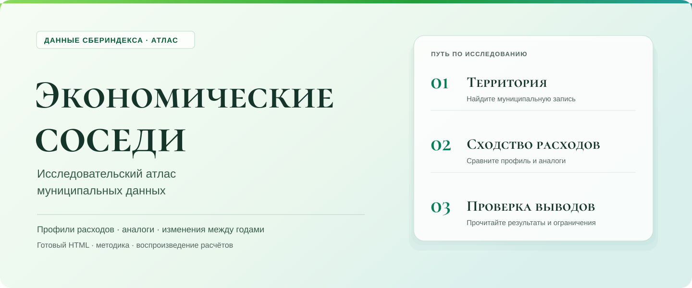

# Экономические соседи



Муниципалитеты с похожими расходами дают полезную точку сравнения. В ретроспективном расчёте по 2 016 МО средняя абсолютная ошибка (MAE) оценки номинального роста расходов 2024 года по 15 экономическим аналогам составила **2,486 п.п.**: по медиане своего региона 2,628 п.п., по случайным соседям своего региона 2,701 п.п. Данные 2024 года участвовали в выборе модели. Это сравнение наблюдённых результатов; точность будущего прогноза не установлена. [Расчёт, интервалы и условия применения](docs/NETWORK_TYPOLOGY.md#как-использовать-аналоги).

В другой зафиксированной проверке на 903 МО ограничение аналогов той же группой не улучшило оценку роста: MAE 3,001 п.п. против 2,991 п.п. у 15 ближайших соседей по тем же шести признакам. Графовые пути в текущем подборе аналогов не участвуют. [Экономическая проверка и её условия](reports/competition-enhancement/interpretation/economic-findings.md).

Атлас помогает найти территорию, сравнить её расходы с 15 аналогами и проследить изменения за 2023–2024 годы. Например, в Усть-Камчатском районе в 2023 году отношение маркетплейсов к общему показателю составляло 4,86%, а зарплата организаций 100,6 тыс. руб. [Три экономических кейса](reports/competition-enhancement/interpretation/economic-findings.md) показывают, как проверять местный профиль и сопоставимость аналогов.

2 016 муниципалитетов · 73 региона · 24 месяца · 48 384 наблюдения · СберИндекс

[Открыть атлас](https://nibani.github.io/sber-public/) · [Проверить одной командой](#запустить-проверку) · [Краткий отчёт](docs/REPORT_RU.md) · [Все расчёты](reports/README.md)

## Что посмотреть в атласе

1. Найдите муниципалитет на карте или в поиске. Сравните его профиль с 15 аналогами; проверьте муниципальный тип и уровень расходов. Исключите одну категорию и посмотрите, как меняется список.
2. Откройте «Динамику»: сравните месяцы, затем 2023 и 2024 годы на карте. Включите поправку на общую волну.
3. В «Доказательствах и данных» проверьте ошибки аналогов, изменения маркетплейсов и сравнения с KMeans4, H75, DMoN, Leiden и непрерывным ядром.

Группы построены по пяти отношениям категорий к общему показателю и уровню расходов; основная совместная модель использует α=0,5. Расходы в таблице относятся к 2023 году: это модельные оценки средних месячных безналичных расходов жителя МО. Все значения приведены как медианы; охват внешних показателей указан рядом с ними.

| Расходный профиль | Число МО | Общие расходы, тыс. руб. | Маркетплейсы, % общего показателя | Зарплата организаций, тыс. руб. и охват МО | Доступность рынков и охват МО |
| --- | ---: | ---: | ---: | --- | --- |
| Высокие расходы и услуги | 338 | 41,5 | 9,5 | 87,6; 184 из 338 | 453,4; 337 из 338 |
| Средние расходы | 580 | 25,9 | 9,9 | 54,9; 561 из 580 | 309,1; 580 из 580 |
| Низкие расходы и повседневные покупки | 971 | 20,0 | 12,2 | 43,4; 958 из 971 | 321,8; 971 из 971 |
| Низкая доля маркетплейсов | 127 | 33,1 | 4,6 | 90,2; 127 из 127 | 138,1; 116 из 127 |

Доли пяти категорий не образуют полного бюджета: каждая рассчитана относительно общего показателя СберИндекса. Доступность рынков измеряет отдельный индекс с собственным периодом. Названия групп не определяют отрасль экономики; например, медиана доли добычи 24,5% в четвёртой группе относится к 44 из 127 МО. [Полная таблица и охват](reports/v1.2/types.csv) · [Источники и методика](docs/NETWORK_TYPOLOGY.md).

## Посмотреть атлас

**[Открыть атлас в браузере](https://nibani.github.io/sber-public/)** — скачивание и установка не нужны.

Для работы без интернета скачайте репозиторий через **Code → Download ZIP**, распакуйте его и откройте [docs/index.html](docs/index.html) в браузере. Карта, поиск и сравнения работают без интернета и без Python. Сохраните рядом папку `docs/assets`, где лежат данные карты и расчётов.

## Запустить проверку

Для проверенного окружения используйте Python 3.10 и Node.js 22 LTS. Из корня репозитория выполните:

```sh
python -m pip install -r requirements-models.txt
python run_all.py
```

`run_all.py` проверяет входы, повторяет два основных научных расчёта, сверяет сохранённые внешние и синтетические результаты, запускает тесты атласа и проверяет переключатели. Ход проверки, журнал и JSON сохраняются в `artifacts/run-all`; ошибка любого этапа даёт ненулевой код возврата. Проверка переключателей использует поддельный DOM: вид карты и скорость в реальном браузере проверяются отдельно. `--quick` запускает только быстрые технические проверки и оставляет научное воспроизведение непроверенным.

Подготовленная панель, конфигурация, внешние данные и сохранённые результаты входят в комплект. Сырые архивы для двух основных расчётов не нужны. Их можно запустить отдельно:

```sh
python -m scripts.validate_v12_findings --check
python -m scripts.check_added_value --check
```

Первая команда повторяет основные экономические проверки с исключением каждого региона. Вторая сравнивает группы с уровнем расходов и непрерывными отношениями категорий, включая bootstrap-t и поправки на множественные сравнения. Обе воспроизводят сохранённую исследовательскую модель, в выборе которой участвовал 2024 год. Значения 2025 года не используются. [Входы и команды подготовки](docs/REPRODUCE.md#19-сетевая-типология-и-проверка-аналогов) · [Файлы, подтверждающие каждый вывод](docs/EVIDENCE.md).

Полный синтетический опыт запускается отдельно: установите зависимости из `reports/competition-enhancement/synthetic/executed-20261009/provenance/requirements-reproduction.txt`, затем выполните:

```sh
python -B -X utf8 -m scripts.reproduce_synthetic --output runs/synthetic-full-reproduction
```

Каталог результата должен отсутствовать. `run_all.py` сверяет сохранённые артефакты этого опыта без повторного обучения.

## Что подтверждено и где границы

В синтетическом опыте (160 объектов, 4 группы, 32 оценочных повтора для каждого из двух генераторов) при слабых признаках Potts α=0,5 на независимой информативной сети повысил ARI относительно KMeans: для Gaussian 0,448 против 0,162, для Panel 0,393 против 0,140. Граф из тех же слабых признаков почти не улучшил разделение; в проверке переходов этого режима с общей поправкой полнота составила 6,93% против 8,25% у KMeans при целевом пороге 80%. [Полный план, числа и границы применимости](reports/competition-enhancement/synthetic/executed-20261009/REPORT.md).

На 36 копиях неизменного профиля годовая сетевая метка и проекция на центроид расходились у 48 из 2 016 МО; эти же МО получали флаг устойчивой смены. Такой флаг не доказывает экономический переход. [Диагностика основной модели](reports/competition-enhancement/synthetic/executed-20261009/REPORT.md).

Четыре группы дают компактное описание расходов. Дополнительный выигрыш в объяснении внешних показателей ограничен: для зарплаты уровень расходов даёт R² 0,734, группы 0,430. После поправки на восемь показателей значимого прироста групп сверх нелинейного уровня для зарплаты нет; значима только доля добычи. При общей поправке на 48 проверок значимого прироста нет. Выигрыш групп сверх непрерывных отношений категорий также не подтверждён. [Сравнение зарплаты с уровнем](reports/v1.2/wage_level_comparison.json) · [Добавочная ценность групп](reports/v1.2-added-value/README.md).

Сеть показывает сходство расходов жителей. Она не измеряет поездки или денежные потоки; пяти категорий недостаточно для полного бюджета. Для производственной типологии нужны более полные отраслевые данные, а эффект конкретных мер требует исследования причин и последствий. При выборе модели только по критериям 2023 года получается α=0,1: меняются 37 из 2 016 назначений, около 1,8%. Близость разбиений сама по себе не подтверждает устойчивость экономических выводов. Проверка на будущем периоде ещё предстоит.

Основной граф построен по тем же шести признакам расходов и сглаживает назначения KMeans. AVI, AVU и MQ на нём не служат независимым подтверждением; целевая функция не гарантирует улучшения каждого индекса. Среди шести допустимых вариантов семейство совместной модели выигрывает в 99,4% из 500 региональных подвыборок, точное α=0,5 в 57,2%; при других α различаются 17–38 назначений. Здесь ранжируются фиксированные разбиения без переобучения. [Метод и размен между индексами](docs/NETWORK_TYPOLOGY.md#почему-четыре-группы) · [Чувствительность выбора](reports/v1.2-method-ties/README.md).

В [20 дополнительных повторах](reports/competition-enhancement/seed-stability/README.md) все 2 016 назначений совпали после сопоставления групп: это устойчивость оптимизации на тех же данных и графе, не вероятность верного экономического типа.

Архивные модели проверяются отдельно и требуют четырёх полных исторических пакетов; комплект для жюри содержит сводки и выбранные результаты. [Команда и область архивной проверки](docs/TECHNICAL_ACCEPTANCE.md).

## Где проверять критерии конкурса

Названия соответствуют [Положению конкурса, приложению 1](https://sber.ru/common/assets/sber/sberindex_polozhenie_o_konkurse.pdf).

| Критерий | Материалы для проверки |
| --- | --- |
| Простота объяснения методологии | [От вопроса к признакам, сети, группам и аналогам](docs/NETWORK_TYPOLOGY.md), [формулы](docs/NETWORK_TYPOLOGY.md#пять-отношений-и-уровень) |
| Построение сетевой и атрибутивной структуры | [Девять правил рёбер](docs/NETWORK_TYPOLOGY.md#девять-правил-рёбер), [источники](docs/DATA_SOURCES.md) |
| Сравнение методов | [Выбор K и сетевое сравнение](docs/NETWORK_TYPOLOGY.md#почему-четыре-группы), [чувствительность выбора](reports/v1.2-method-ties/README.md), [архивные сравнения](docs/ARCHIVE_V11.md) |
| Использование ICVI | [Десять вариантов методов и параметров](reports/v1.2/methods.csv), [формулы и конвенции](docs/METRICS.md). MQ, Newman Q и TurboMQ определены по-разному; Положение не задаёт официальную формулу MQ |
| Интерпретация результатов | [Применение аналогов](docs/NETWORK_TYPOLOGY.md#как-использовать-аналоги), [экономические проверки](docs/NETWORK_TYPOLOGY.md#что-группы-говорят-об-экономике), [добавочная ценность](reports/v1.2-added-value/README.md), [воспроизведение](docs/EVIDENCE.md) |
| Визуализация | [Атлас](#посмотреть-атлас): карта, профили, аналоги, сеть и динамика |

Автор проекта: [Nibani](https://github.com/Nibani). Расходы, дорожная доступность и реестр: СберИндекс, CC BY-SA 4.0. Географическая основа включает Росстат и OpenStreetMap. [Источники, преобразования и лицензии](docs/DATA_SOURCES.md).

