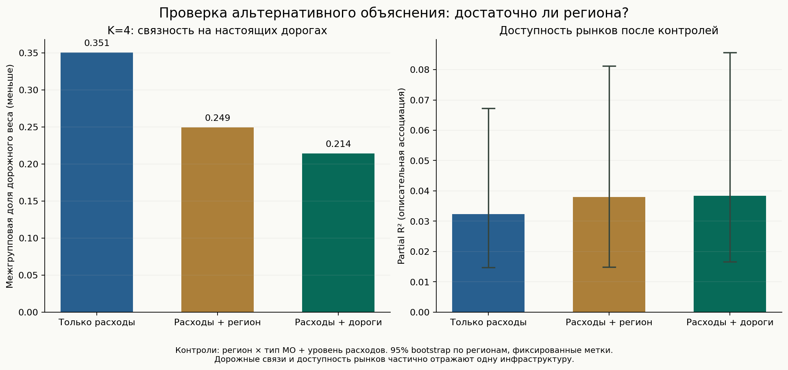
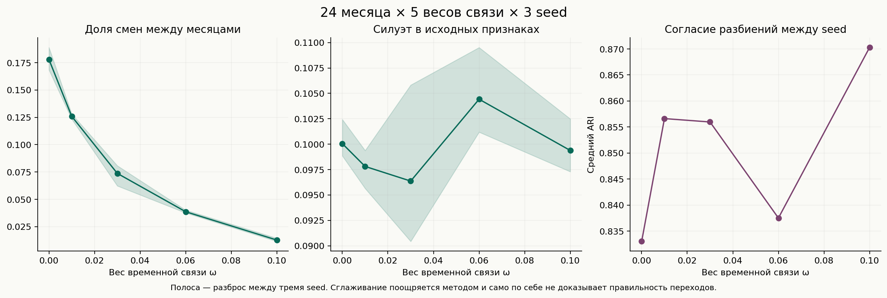

# Приложение: региональные и временные сравнения

Основные результаты, выбор модели и их смысл собраны в [главном отчёте](REPORT_RU.md). Здесь — подробности контрольных экспериментов, полные таблицы и ссылки на исходные расчёты от 24 сентября 2026 года.

## Дорожные связи и регион — разные проверки

Контрольная сеть соединяет все муниципалитеты внутри каждого региона. Вес каждого такого ребра равен `1/(n_region−1)`, поэтому суммарный вес связей каждой неизолированной вершины равен единице. При том же α=0,25 она проверяет административное предпочтение, а не конкретные дорожные расстояния. Плотность этой сети отличается от дорожной; это содержательный контроль, не полная замена её топологии.

| K=4 | Силуэт ↑ | SSE/TSS ↓ | Доля дорожного веса между группами ↓ | Partial R² доступности рынков |
|---|---:|---:|---:|---:|
| KMeans, только расходы | 0,2402 | 0,4624 | 0,3506 | 0,03237 |
| Расходы + свой регион | 0,2316 | 0,4812 | 0,2493 | 0,03792 |
| Расходы + настоящие дороги | 0,2326 | 0,4802 | 0,2141 | 0,03842 |

Настоящие дороги дают меньший дорожный разрез, чем региональный контроль, при близком разбросе потребления. Но добавленная внешняя ассоциация почти одинакова: разность partial R² между дорожной и региональной моделью — **0,00049**. Отдельный интервал этой разности не рассчитывался.

Для дорожной модели против KMeans разность partial R² составляет **+0,00605**, а парный 95% региональный bootstrap-интервал — **[−0,02109; +0,03694]**. Устойчивое внешнее улучшение эта проверка не подтверждает. Сравнение использует одну когорту из 2 004 МО и одинаковые bootstrap-выборки; из исхода и индикаторов групп исключены регион × тип МО и логарифм уровня расходов. Интервалы условны на фиксированные метки, это не причинный эффект. Дороги и доступность рынков частично отражают одну инфраструктуру.

Три прежние перестановки дорожного графа внутри регионов восстанавливают **76,4–83,4%**, в среднем **79,9%**, снижения разреза на настоящих дорогах. Это не «79,9% эффекта, объяснённого регионом»: перестановка сохраняет также топологию и региональное смешивание графа. Трёх повторений недостаточно для надёжного распределительного вывода.

[Полные метрики](../reports/round2-2026-09-24/round2-20260924-region_control/metrics.json) · [Парное внешнее сравнение, включая K=2 и исключение внутригородских МО](../reports/round2-2026-09-24/round2-20260924-region_control/external_comparison.json)

## Временная сетка

Полная сетка: 24 месяца × ω=0/0,01/0,03/0,06/0,1 × три seed. Два результата первой серии использованы повторно с проверкой хешей и настроек; остальные 13 получены в этой серии. Для всех вариантов задано четыре итерации Leiden, без утверждения о сходимости. Таблица усредняет три seed; ARI между seed усреднён также по месяцам.

| ω | ARI соседних месяцев | Доля смен после сопоставления | SW | ARI между seed | Смены, согласованные во всех 3 seed |
|---:|---:|---:|---:|---:|---:|
| 0 | 0.674 | 17.80% | 0.100 | 0.833 | 3500 |
| 0.01 | 0.740 | 12.59% | 0.098 | 0.857 | 2544 |
| 0.03 | 0.832 | 7.38% | 0.096 | 0.856 | 1157 |
| 0.06 | 0.904 | 3.87% | 0.104 | 0.838 | 491 |
| 0.1 | 0.964 | 1.28% | 0.099 | 0.870 | 214 |

По мере роста ω средняя доля месячных смен падает с **17,80% до 1,28%**, но средний по трём seed силуэт остаётся в узком диапазоне **0,096–0,104**, а согласие между seed не растёт монотонно. Высокая временная устойчивость сама по себе не выбирает лучшую модель.

Стабильность между месяцами поощряется самим методом. Для содержательной проверки нужны также сходство разбиений между seed и сохранение геометрического разделения по расходам. Максимальная неподвижность не выбирается как цель; единственный «оптимальный ω» не объявляется.

В месячных срезах получено от пяти до девяти групп, поэтому это не те же четыре опорных профиля. Смена номеров кластеров не считается переходом. Сопоставление максимизирует пересечение составов; если равнооптимальные сопоставления дают для территории разный ответ, событие отмечается неоднозначным и исключается из согласованных переходов. Согласие трёх seed означает согласие о факте смены, но не тождество её направления и не подтверждённый экономический перелом. Один муниципалитет может иметь несколько событий в разные месяцы. [Сводка событий](../reports/round2-2026-09-24/round2-20260924-temporal_grid/temporal_summary.json) · [Все события](../reports/round2-2026-09-24/round2-20260924-temporal_grid/transition_events.csv).

Из 127 МО исходного профиля с низкой интенсивностью маркетплейсов хотя бы одну однозначную смену во всех трёх seed имеют **118, 83, 37, 6 и 4 МО** при последовательном увеличении ω. На сильном сглаживании эта динамика почти исчезает. Временной Leiden поэтому не даёт независимого подтверждения истории сжатия фиксированной группы 127 → 27: способы группировки различаются, а вывод сильно зависит от временного веса. Совпадение числа 127 всех МО с согласованным переходом при ω=0,1 с исходным размером маркетплейсного профиля случайно; пересекаются только четыре территории.

## Архив первой проверки DMoN

Первая серия ограничивалась 1 000 эпохами и показала продолжающееся снижение loss. Она сохранена для сравнения с продолженным обучением: [Сводка первой серии](../reports/round2-2026-09-24/round2-20260924-dmon/summary.json) · [Метрики](../reports/round2-2026-09-24/round2-20260924-dmon/metrics.json). Окончательное сравнение после проверки плато находится в [главном отчёте](REPORT_RU.md#что-добавляют-дороги-и-dmon) и [новых результатах](../reports/dmon-plateau-2026-09-25/).

[Кейс Абазинского района](../reports/round2-cases/) · [Локальные показатели Росстата](../reports/external-round2/) · [Воспроизведение](REPRODUCE.md)
