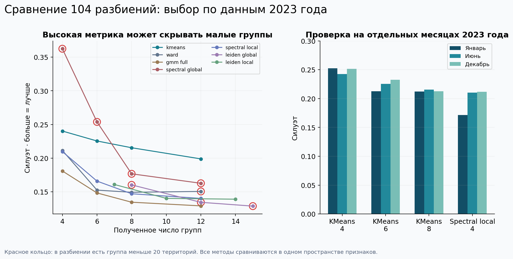
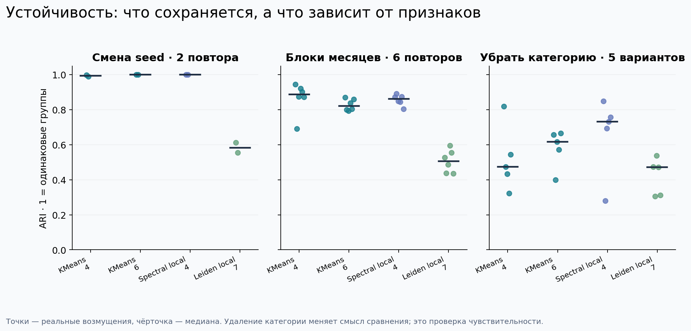
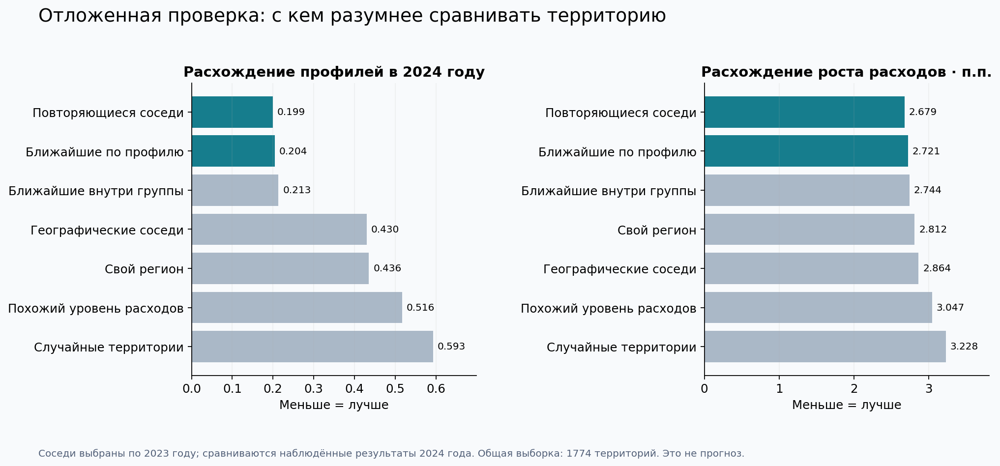
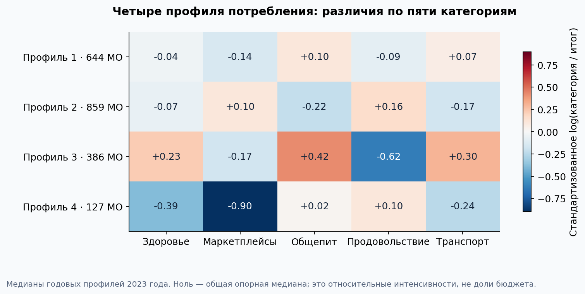

# Экономические соседи: расширенное исследование

Версия от 23 сентября 2026 года. Все числа ниже получены на данных СберИндекса, а не на синтетическом примере.

## Вопрос и практический результат

Я хочу находить для муниципалитета понятные аналоги по потребительскому профилю. Группа — краткое описание, а список ближайших соседей — средство конкретного сравнения. Выбор категории в атласе позволяет увидеть, насколько сходство зависит от признака.

## Данные и измерение

303 126 исходных оценок, 2 190 территорий, 77 регионов, 2023–2024 годы. Для сопоставления используется официальная territory_id, а не неоднозначное название. В полной панели 2 016 территорий и 48 384 пары «территория—месяц»; 174 неполных ряда не заполняются искусственно.

Признаки — пять log(расходы категории / общий итог). Центр и IQR вычислены по наблюдениям 2023 года и затем фиксированы. Вес общего уровня равен нулю. Это отношения модельных оценок расходов, не проверенные аддитивные доли бюджета и не показатели выпуска предприятий.

**Ограничение состава выборки:** полная панель выбрана с учётом наличия данных и в 2023, и в 2024 году. Параметры не подбираются по значениям 2024 года, но это не выборка, определённая исключительно информацией, доступной в 2023 году. Все месячные сравнения также ретроспективны: их масштабирование использует весь 2023 год.

## Архитектуры и протокол

Проверены KMeans (20 инициализаций), Ward, Gaussian Mixture с полной ковариацией (3 инициализации), спектральный метод с cluster_qr и Leiden. Для двух сетевых методов проверены глобальная полоса ядра и локальный масштаб: расстояние до седьмого соседа, вес exp(−d²/(σ_i σ_j)). Сеть — объединение направленных 15 ближайших соседей.

Это использование локального масштаба [Zelnik-Manor и Perona](https://papers.nips.cc/paper_files/paper/2004/file/40173ea48d9567f1f393b20c855bb40b-Paper.pdf), а не воспроизведение всего их алгоритма выбора K. Реализации: [SpectralClustering 1.5](https://scikit-learn.org/1.5/modules/generated/sklearn.cluster.SpectralClustering.html), [Gaussian mixtures](https://scikit-learn.org/1.5/modules/mixture.html), [Leiden](https://leidenalg.readthedocs.io/en/stable/reference.html).

Для методов с заданным K проверены 4, 6, 8 и 12 групп; для Leiden — resolution 0,4 / 0,7 / 1. Четыре представления: январь, июнь, декабрь и покомпонентная медиана 12 месячных профилей 2023 года. Всего **104 разбиения**. Атрибутивные метрики вычислены в одинаковом пространстве, сетевые — на общем бинарном опорном графе каждого представления. Число групп у Leiden получается из алгоритма и не приравнивается к заданному K других методов.

## Сравнение на годовом профиле

| Метод | K | SW ↑ | CH ↑ | AVI ↑ | AVU ↓ | Минимальная группа |
|---|---:|---:|---:|---:|---:|---:|
| kmeans_k4 | 4 | 0.2402 | 779.8 | 0.8847 | 0.5296 | 127 |
| ward_k4 | 4 | 0.2114 | 681.7 | 0.8859 | 0.5163 | 138 |
| gmm_full_k4 | 4 | 0.1809 | 482.2 | 0.8042 | 0.5449 | 189 |
| spectral_global_k4 | 4 | 0.3624 | 480.0 | 0.7563 | 0.5649 | 8 |
| spectral_local_k4 | 4 | 0.2097 | 588.0 | 0.9050 | 0.6015 | 81 |
| leiden_global_r0p4 | 8 | 0.1603 | 412.1 | 0.7363 | 0.4138 | 6 |
| leiden_local_r0p4 | 7 | 0.1609 | 526.6 | 0.8505 | 0.5032 | 135 |

[Полные 104 результата](screen_metrics.csv), [вложенные диагностические поля](screen_metrics.json), [все разбиения CSV.gz](screen_partitions.csv.gz).

Обычная спектральная модель с K=4 лидирует по SW, но её минимальная группа содержит 8 территорий. Для основной широкой типологии я выбрал KMeans4: SW=0,2402, размеры 644/859/386/127. Выбор сделан после просмотра результатов на обучающем периоде; порог 20 территорий — практический критерий этого решения, а не заранее зарегистрированный статистический тест. Малые группы других методов могут быть содержательными выбросами и остаются в таблице.

K=4 — минимум проверенной сетки, а не доказанный оптимум по всем возможным K. Метрики компактности благоприятствуют KMeans; преимущество по SW не доказывает экономическую истинность групп. В отличие от исходной настройки KMeans8, здесь проверены число групп и несколько принципиально разных подходов.

## Устойчивость и чувствительность

| Модель | Смена seed: ARI | Блоки месяцев: min / median / max | Удаление категории: min / max |
|---|---|---|---|
| kmeans_k4 | 0.990–0.998 | 0.692 / 0.888 / 0.945 | 0.323–0.819 |
| kmeans_k6 | 1.000–1.000 | 0.793 / 0.821 / 0.869 | 0.400–0.665 |
| spectral_local_k4 | 1.000–1.000 | 0.805 / 0.861 / 0.891 | 0.280–0.848 |
| leiden_local_r0p4 | 0.554–0.613 | 0.435 / 0.506 / 0.595 | 0.305–0.537 |

Выполнено 56 возмущений: дополнительные seed, шесть повторных выборок трёхмесячных циклических блоков, удаление каждой из пяти категорий, k=10 и k=30 для сетевых кандидатов. Seed=1729 остаётся основным; лучший seed не выбирается. Временные блоки сохраняют часть последовательной зависимости. Шесть повторов — диагностическая проверка, недостаточная для точной оценки редких срывов.

KMeans4 воспроизводится при смене инициализации и в большинстве вариантов выбора месяцев. Удаление категории может сильно менять разбиение. Поэтому сходство зависит от вопроса, который задаёт аналитик; интерфейс позволяет проверить эту зависимость. Частота совпадения метки после Hungarian-сопоставления — частота в шести возмущениях, не вероятность правильного экономического типа.

[Все результаты возмущений](stability.csv), [частоты по территориям](membership_stability.json).

## Какие группы получились

Номера в интерфейсе начинаются с 1; в таблицах кода — с 0.

| Профиль | Территорий | Краткое описание относительных интенсивностей |
|---|---:|---|
| 1 | 644 | Промежуточный профиль: общепит выше, чем во второй группе |
| 2 | 859 | Выше маркетплейсы и продовольствие, ниже общепит |
| 3 | 386 | Выше общепит, транспорт и здоровье; ниже продовольствие |
| 4 | 127 | Заметно ниже маркетплейсы; ниже здоровье и транспорт |

Это описания покупок, не производственные специализации. [Региональная проверка Росстата](../../external/altai-2024/README.md) показывает, почему даже заметный туризм не даёт автоматического названия всему потребительскому кластеру.

## Отложенные значения и независимые источники

[Выбор модели и параметры зафиксированы](../../../configs/selection_frozen_20260923.json) до оценки значений 2024 года. Протокол сравнивает семь способов выбора аналогов по двум исходам: расхождение годового профиля и расхождение роста общего уровня расходов. Соседи выбираются только по 2023 году. Наблюдённые исходы соседей в 2024 году используются для сравнения, поэтому это **согласованность аналогов, не прогноз**. Интервалы — парный bootstrap целых регионов, с весом муниципалитетов; пространственная зависимость между регионами полностью не устраняется. Случайный контроль использует один фиксированный draw и не охватывает всю его вариативность.

Стадия завершена: [исходные результаты и интервалы](validation/peer_validation.json). Общая выборка — 1 774 территории, 71 регион; 242 территории исключены по единому набору требований к координатам и наличию аналогов.

| Метод | Расхождение профилей | Расхождение роста расходов, п.п. |
|---|---:|---:|
| Повторяющиеся месячные соседи | 0,199108 | 2,678903 |
| Ближайшие по годовому профилю | 0,204380 | 2,721385 |
| Ближайшие по профилю внутри группы | 0,213264 | 2,744472 |
| Географические соседи | 0,430319 | 2,864113 |
| Все остальные территории своего региона | 0,435545 | 2,811895 |
| Близкие по уровню расходов | 0,516439 | 3,046980 |
| Случайные территории | 0,592534 | 3,227939 |

Повторяющиеся соседи уменьшают расхождение профилей на **54,285% против всех остальных территорий региона** и на **2,579% против ближайших годовых профилей**. Для роста расходов улучшение против региона — **4,730%**. Это величины в данной ретроспективной выборке; они не гарантируют будущего преимущества.

Условный парный bootstrap регионов для разности «обычные профильные соседи минус повторяющиеся»: по профилю +0,005272, 95%-интервал [0,003277; 0,007463]; по росту +0,042482 п.п., [0,007904; 0,074988]. Публикуются все предусмотренные сравнения, интервалы без поправки на множественность. Зависимости через общих соседей и между регионами полностью не устранены. Сравнение с `region_all` не является сравнением со всеми возможными региональными алгоритмами.

**Отрицательный результат тоже влияет на архитектуру:** ограничение годовых соседей одним кластером увеличивает расхождение профилей на 0,008884. Интервал улучшения [-0,011282; -0,006784] отрицателен. По росту отличие мало и интервал включает ноль. Поэтому данные поддерживают поиск аналогов без жёсткого ограничения группой. Четыре профиля остаются описательным слоем, не обязательным фильтром соседей.

Фиксированные прототипы 2023 года на годовом профиле 2024 дали SW=0,269676, CH=814,275, S_Dbw=0,924846, AVI=0,820186 и AVU=0,518591. Однако ARI между годами только 0,559700: **380 из 2 016 территорий (18,849%)** поменяли ближайший прототип. Максимальная группа выросла до 1 162, минимальная сократилась до 27. Хорошая геометрическая метрика не означает неизменную типологию. [Исходные значения](validation/confirmation_metrics.json), [помесячные назначения](validation/monthly_assignments.csv).

Во внешнем индексе доступности рынков связь с кластерами η²=0,4054 до учёта регионов и только 0,0362 после вычитания средних по регионам. Большая часть сырой связи сопровождает региональные различия. Перестановочное p=0,005 — минимальное достижимое значение при 199 перестановках, не высокоточная оценка малой вероятности. [Внешняя проверка](validation/external_market_access.json).

Даже при нулевом явном весе уровня расходы остаются связаны с профилями: группы объясняют 54,0% дисперсии log среднего общего расхода 2023 года. Это ассоциация, не доля причинного влияния. AMI между метками региона и группы =0,1968; слово adjusted означает поправку самой метрики на случайное совпадение, не устранение географии. [Проверка альтернативных объяснений](validation/confounding.json).

Индекс доступности рынков 2024 года использован как внешний описательный показатель после фиксации модели. Росстат даёт отдельную локальную проверку по 11 муниципалитетам Республики Алтай. Ни один из них не является эталонной разметкой экономических типов.

## Метрики и нерешённые определения

S_Dbw неопределён в 55 из 104 разбиений при исходной конвенции плотности; значения оставлены null. В новых запусках сохраняются радиус и число пустых шаров. Формула проверена по первоисточникам и аналитическим примерам. Замена нулевого знаменателя на epsilon не применяется. [Определения и ручные тесты](../../../docs/METRICS.md).

MQ остаётся null до уточнения определения у организаторов. Она не подменена обычной модульностью. Это незакрытая часть конкурсного критерия, а не нулевой результат модели.

Справочник подтверждает постоянные territory_id и годовое соответствие кодов. Полнота изменений внутри 2024 года отдельно не проверена. Временная регуляризация и заявления о структурных переходах поэтому не включены в доказанные результаты.

## Воспроизводимость и вычисления

[summary.json](summary.json) связывает стадии с исходными запусками. В `provenance/` сохранены конфигурации, версии исходников и журналы ресурсов; каждый файл снимка совпадает с хешем, записанным во время запуска. [SHA256.json](SHA256.json) фиксирует опубликованные артефакты. Локальный git commit в provenance относится к исходному рабочему дереву; для воспроизведения служит приложенный точный снимок, а не разрешимость этого commit в публичной истории.

Запуск: `configs/research_annual.json`, `configs/research_months.json`, `configs/research_stability.json`; затем замороженный `configs/research_validation.json`. Каждый конфиг запускается через `scripts/run_bounded.py`. `scripts/export_research_results.py` собирает завершённые стадии, `scripts/build_research_figures.py` строит рисунки без обучения. Пути новых runs передаются аргументами экспортёру.

Успешная стадия 2024 заняла 30,219 с, включая две паузы из-за диска. Пиковая общая RAM — 63,8%; жёсткие CPU/память и отсутствие GPU подтверждены журналом. Первые попытки были заблокированы до получения результатов; после снижения нагрузки выполнен тот же замороженный протокол, без изменения параметров по будущим значениям.

Рост относится к номинальным оценкам безналичных расходов, без дефлирования. Он не равен росту реального выпуска или доходов. Профильный исход измеряет те же характеристики в следующем году и не является независимым подтверждением отраслевой специализации. Успешная проверка показывает полезность сравнения расходов в этой выборке.

Интерфейс проверен отдельно для 242 территорий вне общей выборки: у них доступен годовой поиск, а неподтверждённый список повторяющихся связей не подставляется. Исключение категории заблокировано в режиме повторяющихся связей, чтобы не смешивать смену метода со сменой признака. 55 unit-тестов проходят; браузерные проверки охватывают оба режима, переходы, 15 соседей и мобильную ширину.

Научные результаты и разбиения сохранены без изменений. Служебные журналы машины исключены из публикационного пакета; перечень изменений упаковки — `PUBLICATION_CHANGES.json`.
